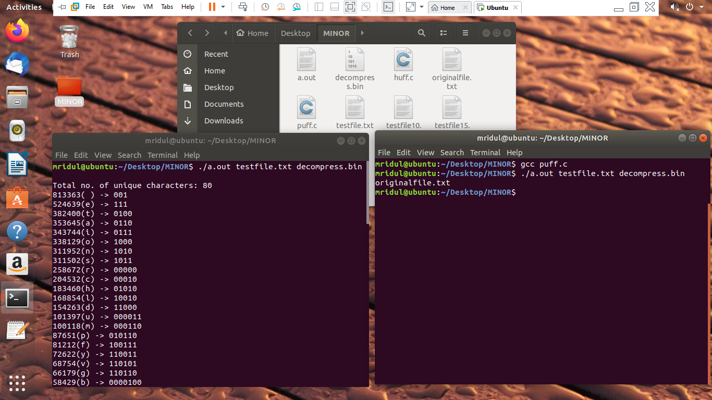

# .TXT-Compressor-Decompressor  
Implemented Word-based lossless compression algorithm for text files by exploiting the redundancies in the text, compressing  it to represent the input file in less space and simulating channel transmission over UDP protocol. After complete reception, de-compressing it to retrieve the original text file. The whole project was developed in C language. 

## Objectives:
1. To establish a connection between CLIENT and SERVER using socket programming.
2. To implement compression  algorithm to compress the  text file.
3. To implement  de-compression algorithm to de-compress the text file.
4. To calculate the compression ratio, and space saving percentage. 

## Algorithm Implemented:

#### For compression: Huffman Encoding Algorithm:

#### For transmission: Socket Programming:

## Data Flow Diagram:

## Flowchart of the complete system:

## Steps to Execute program:
1. Ubuntu or any Linux Operating system must be installed.

   For Ubuntu you can download from this link: https://ubuntu.com/download/desktop
2. First execute **server.c** file to open a port to which client will connect.
   #gcc server.c -o server
   #./server 9989
   
3. Then execute **client.c** file to successfully etsablish a connection between client and server using socket programming.

   #gcc client.c
   
   #./client 127.0.0.1 9989
   
   .png)
   
   Basically you have built a chatbox system in Linux. Server and Client can exchange messages with each other.
4. Then execute **huff.c** file and also specify **input file name** or the text file which you want to compress and **output file          name** which is basically the decompressed file. Huffman codes for each unique character will be generated and displayed as output on    to the screen.

   #gcc huff.c
   
   **format:** ./a.out [input-file-name].txt [compressed-file-name].bin
   
   #./a.out testfile.txt compressedfile.bin
   
5. After running this command, a new file will be generated in your files directory which contains the compressed file. 
6. To decompress this compressed file execute **puff.c** file.

   #gcc puff.c
   
   **format:** ./a.out [input-file-name].txt [compressed-file-name].bin [decompressed-file-name].txt
   
   #./a.out testfile.txt compressedfile.bin decompressedfile.txt
   
7. After running this command, a new file will be generated in your files directory which contains the decompressed file with original     file contents 
   
   
  
  ## Result:
  
  
 
 We are able to compress large size text files to smaller size files, which can be transported fastly and stored easily occupying less storage space. A detailed analysis of the program is done by giving different file size(in MB) as input and the output which we got is reflected in this graph. 
 
## Performance Parameters:
Performance evaluation of the proposed algorithm is done using two parameters-Compression Ratio and Saving Percentage

#### COMPRESSION RATIO:
Compression ratio is defined as the ratio of size of the compressed file to the size of the source file.
**Compression ratio= (C2/C1) *100%**

#### SAVING PERCENTAGE:
Saving Percentage calculates the shrinkage of the source file as a percentage
**saving percentage = (C1-C2/C1)*100%**

C1= Size before compression
C2= Size after compression

## Limitations:
• This project deals only with text files.

## Future Enhancements:
Some of the possible amendments and improvements to be carried out in future are:

•	Include transfer of other files such as jpg, mp4 etc.

•	Include encryption algorithm for secure transmission of files.
